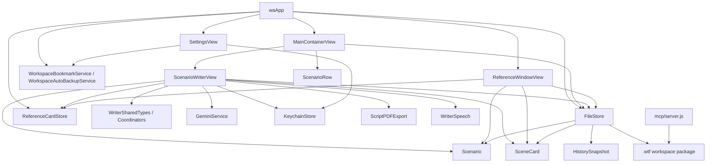

# 00 Project Index

## Repository Snapshot

- Repository root: `/Users/three/app_build/wa`
- Primary app target: `wa` -> built product `WTF.app`
- Platform detected: macOS SwiftUI app with extensive AppKit interop
- App category detected: complex text editing / screenplay-style structured writing tool
- Xcode targets detected: 1 app target, 0 test targets
- Swift source files under app target: 28
- SwiftUI `View` conformances: 16
- Files containing SwiftUI views: 7
- Dedicated `ViewModel` files: 0
- `ScenarioWriterView` extension files: 12
- Important note: the Xcode project uses a filesystem-synchronized `wa/` root group, so app source organization is currently determined by the flat folder layout on disk

## 1. Complete Folder Structure

Notes:
- The repository contains the macOS app, prior analysis docs, content-generation artifacts, and an MCP helper server.
- Generated or vendor-heavy folders are shown but collapsed when expanding them would add noise without changing the architectural map.
- `.git`, `.codex_derived`, `.DS_Store`, and `node_modules` are included as structure markers but not expanded exhaustively.

```text
.
├── .codex_derived/                    # local derived/build artifacts
│   ├── Build/
│   ├── CompilationCache.noindex/
│   ├── Index.noindex/
│   ├── Logs/
│   ├── ModuleCache.noindex/
│   └── SDKStatCaches.noindex/
├── .git/                              # git metadata, collapsed
├── .sisyphus/
│   ├── drafts/
│   ├── evidence/
│   └── plans/
├── AI_DOCS/
│   ├── 00_PROJECT_INDEX.md
│   ├── 01_ARCHITECTURE_DIAGNOSIS.md
│   ├── 02_PERFORMANCE_REFACTORING.md
│   ├── 03_MAIN_NAVIGATION_PERFORMANCE_PLAN.md
│   ├── 03_RELEASE_CHECKLIST.md
│   ├── 04_SCROLL_SMOOTHNESS_REFACTOR_PLAN.md
│   ├── 05_SCROLL_SMOOTHNESS_PHASE1.md
│   ├── 06_SCROLL_SMOOTHNESS_PHASE2.md
│   ├── 07_SCROLL_SMOOTHNESS_PHASE3.md
│   ├── 08_SCROLL_SMOOTHNESS_PHASE4.md
│   ├── 09_SCROLL_SMOOTHNESS_PHASE5.md
│   ├── 10_SCROLL_SMOOTHNESS_PHASE6.md
│   ├── 11_SCROLL_SMOOTHNESS_PHASE7.md
│   ├── 12_FOCUS_MODE_LAYOUT_REFACTOR_PLAN.md
│   └── 13_FOCUS_MODE_LAYOUT_IMPLEMENTATION.md
├── gildong_phaseF_raw_slices/         # large generated scene slice dataset
├── mcp/
│   ├── .gitignore
│   ├── README.md
│   ├── node_modules/                  # npm dependencies, collapsed
│   ├── package-lock.json
│   ├── package.json
│   ├── scenario-store.js
│   └── server.js
├── wa.xcodeproj/
│   ├── project.pbxproj
│   ├── project.xcworkspace/
│   │   ├── contents.xcworkspacedata
│   │   └── xcuserdata/
│   ├── xcshareddata/
│   │   └── xcschemes/
│   │       └── wa.xcscheme
│   └── xcuserdata/
│       └── three.xcuserdatad/
│           ├── xcdebugger/
│           └── xcschemes/
├── wa/
│   ├── Assets.xcassets/
│   │   ├── AccentColor.colorset/
│   │   ├── AppIcon.appiconset/
│   │   └── Contents.json
│   ├── ContentView.swift
│   ├── FocusModeLayoutCoordinator.swift
│   ├── FocusMonitor.swift
│   ├── GeminiService.swift
│   ├── KeychainStore.swift
│   ├── MainCanvasNavigationDiagnostics.swift
│   ├── MainCanvasScrollCoordinator.swift
│   ├── MainContainerView.swift
│   ├── Models.swift
│   ├── ReferenceWindow.swift
│   ├── Sans Mono CJK Final Draft Bold.otf
│   ├── Sans Mono CJK Final Draft.otf
│   ├── ScenarioRow.swift
│   ├── ScriptPDFExport.swift
│   ├── SettingsView.swift
│   ├── WorkspaceSelectionHelpers.swift
│   ├── WriterAI+CandidateActions.swift
│   ├── WriterAI+ChatView.swift
│   ├── WriterAI+PromptBuilder.swift
│   ├── WriterAI+RAG.swift
│   ├── WriterAI+ThreadStore.swift
│   ├── WriterAI.swift
│   ├── WriterCardManagement.swift
│   ├── WriterCardViews.swift
│   ├── WriterCaretAndScroll.swift
│   ├── WriterFocusMode.swift
│   ├── WriterHistoryView.swift
│   ├── WriterKeyboardHandlers.swift
│   ├── WriterSharedTypes.swift
│   ├── WriterSpeech.swift
│   ├── WriterUndoRedo.swift
│   ├── WriterViews.swift
│   └── waApp.swift
├── 10th.md
├── 10th_phase0.md
├── 10th_phase1.md
├── 10th_phase2.md
├── 10th_phase2_batch01_001-010.md
├── 10th_phase2_batch02_011-020.md
├── 10th_phase2_batch03_021-030.md
├── 10th_phase2_batch04_031-040.md
├── 10th_phase2_batch05_041-050.md
├── 10th_phase2_batch06_051-060.md
├── 10th_phase2_batch07_061-070.md
├── 10th_phase2_batch08_071-080.md
├── 10th_phase2_batch09_081-090.md
├── 10th_phase2_batch10_091-100.md
├── 10th_phase2_batch11_101-110.md
├── 10th_phase2_batch12_111-116.md
├── 10th_phase3.md
├── 10th_phase4.md
├── 10th_phase5.md
├── 10th_phase5_cards_index.backup.json
├── 10th_phase5_sample.json
├── 10th_phase6.md
├── 10th_phase6_card_ids.json
├── 10th_phase6_cards_index.backup.json
├── 10th_phase7.md
├── 10th_phase7_verification.json
├── 10th_phase8.md
├── 10th_phase8_card_ids.json
├── 10th_phase8_cards_index.backup.json
├── 10th_phase8_verification.json
├── Info.plist
├── README.md
├── focus_mode_entry_exit.md
├── focus_mode_entry_exit_plan.md
├── focus_mode_shell_plan.md
├── focus_mode_workspace_positions.md
├── focus_scroll.md
├── focus_scroll_plan.md
├── gildong_phaseA_4acts.md
├── gildong_phaseB_outline.md
├── gildong_phaseC_synopsis.md
├── gildong_phaseD_sequences.md
├── gildong_phaseE_treatments.md
├── gildong_phaseF_raw_mapping.md
├── gildong_phaseF_raw_verification.json
├── gildong_phaseG_app_apply.md
├── gildong_phaseG_app_verification.json
├── gildong_phaseG_card_ids.json
├── gildong_phaseG_cards_index.backup.json
├── gildong_prompt_research.md
├── phase6_write_cards.mjs
├── phase7_verify_cards.mjs
├── phase8_rebuild_nested_tree.mjs
├── phase8_verify_nested_tree.mjs
├── phaseF_generate_raw_mapping.mjs
├── phaseG_apply_app_tree.mjs
├── plan.md
├── plan1.md
├── plan2.md
├── plan_gildong.md
├── research.md
└── scroll.md
```

## 2. Major Modules

| Module | Files | Responsibility |
| --- | --- | --- |
| App shell and workspace bootstrap | `waApp.swift`, `MainContainerView.swift`, `WorkspaceSelectionHelpers.swift` | App entry, window scene composition, workspace selection, security-scoped bookmark restore, startup/shutdown save handling, auto-backup |
| Core domain and persistence | `Models.swift` | `Scenario`, `SceneCard`, `HistorySnapshot`, workspace schema, save/load pipeline, scenario ordering, shared craft tree synchronization |
| Main writing workspace | `WriterViews.swift`, `WriterCardManagement.swift`, `WriterCardViews.swift`, `WriterKeyboardHandlers.swift`, `WriterCaretAndScroll.swift`, `WriterFocusMode.swift`, `WriterHistoryView.swift`, `WriterUndoRedo.swift`, `WriterSharedTypes.swift`, `MainCanvasScrollCoordinator.swift`, `FocusModeLayoutCoordinator.swift` | Primary card editor, timeline/history, focus mode, keyboard control, scroll/caret orchestration, layout caching, undo/redo, rendering support |
| AI authoring features | `WriterAI.swift`, `WriterAI+PromptBuilder.swift`, `WriterAI+RAG.swift`, `WriterAI+ThreadStore.swift`, `WriterAI+CandidateActions.swift`, `WriterAI+ChatView.swift`, `GeminiService.swift`, `KeychainStore.swift` | AI thread state, prompt construction, semantic retrieval, candidate generation, chat UI, remote Gemini calls, API key persistence |
| Reference workspace | `ReferenceWindow.swift` | Separate reference-card window, pinned-card persistence, local undo/redo, save throttling |
| Speech and dictation | `WriterSpeech.swift` | Live recording, speech permissions, transcript/summarization flow, dictation card creation |
| Export pipeline | `ScriptPDFExport.swift` | Script parsing plus text/PDF export in centered and Korean layouts |
| Settings and preferences | `SettingsView.swift` | Appearance, export settings, backup path, workspace reset/open/create, Gemini model selection, shortcuts/about |
| Diagnostics and instrumentation | `FocusMonitor.swift`, `MainCanvasNavigationDiagnostics.swift` | Focus/navigation logging, debug monitoring panel, canvas diagnostics helpers |
| External tooling | `mcp/` | Repository-local MCP server that reads/writes the same `.wtf` workspace schema outside the app target |

## 3. View Files

Files containing concrete SwiftUI `View` types:

| File | View types |
| --- | --- |
| `wa/MainContainerView.swift` | `MainContainerView` |
| `wa/ScenarioRow.swift` | `ScenarioRow` |
| `wa/ReferenceWindow.swift` | `ReferenceWindowView`, `ReferenceCardEditorRow` |
| `wa/FocusMonitor.swift` | `FocusMonitorWindowView` |
| `wa/SettingsView.swift` | `SettingsView` |
| `wa/WriterCardViews.swift` | `DropSpacer`, `PreviewCardItem`, `FocusModeCardEditor`, `CardItem` |
| `wa/WriterViews.swift` | `ScenarioWriterView`, `MainCanvasHost`, `TrailingWorkspacePanelHost`, `HistoryOverlayHost`, `WorkspaceToolbarHost`, `BottomHistoryBarHost` |

View summary:
- 7 files define SwiftUI views
- 16 concrete `View` conformances exist
- `wa/ContentView.swift` exists but is effectively empty and is not part of the active UI path

## 4. ViewModel Files

Dedicated `ViewModel` files were not found.

The project instead uses MVVM-adjacent state owners embedded in feature or shared files:

| File | Type | Practical role |
| --- | --- | --- |
| `wa/WriterSharedTypes.swift` | `MainCanvasViewState` | Canvas restore/navigation tick state used to isolate some render invalidation |
| `wa/WriterSharedTypes.swift` | `WriterAIFeatureState` | UI-facing state bucket for AI chat, embeddings, generation status, and candidate tracking |
| `wa/WriterSharedTypes.swift` | `WriterEditEndAutoBackupState` | UI-owned backup scheduling state |
| `wa/WriterSharedTypes.swift` | `ScenarioWriterObservedState` | Observable adapter that projects `Scenario` changes into view signals |
| `wa/MainCanvasScrollCoordinator.swift` | `MainCanvasScrollCoordinator` | Observable coordinator for scroll view registration, geometry, and navigation intents |
| `wa/FocusModeLayoutCoordinator.swift` | `FocusModeLayoutCoordinator` | Observable cache/coordinator for focus-mode height and caret layout |
| `wa/ReferenceWindow.swift` | `ReferenceCardStore` | Store-like state owner for the reference window |

Architecture note:
- The codebase is not currently organized as formal MVVM.
- Most feature behavior still lives directly inside `ScenarioWriterView` and its extensions.

## 5. Model Files

| File | Key model types |
| --- | --- |
| `wa/Models.swift` | `Scenario`, `SceneCard`, `HistorySnapshot`, `CardSnapshot`, `ScenarioRecord`, `CardRecord`, `HistorySnapshotRecord`, `LinkedCardRecord`, `FileStore` |
| `wa/WriterAI.swift` | `AIChatMessage`, `AIChatThread`, `AIChatThreadScope`, `AIEmbeddingRecord`, `AIChatTokenUsage`, prompt/context payload structs |
| `wa/WriterSharedTypes.swift` | Category constants, layout values, clipboard payloads, diff models, focus-mode snapshots, drag/drop payloads, AI action enums |
| `wa/ScriptPDFExport.swift` | Script export enums, layout config, parsed export element types |

Primary persisted workspace schema:
- Workspace container: `.wtf` package
- Root metadata: `scenarios.json`
- Per-scenario folder: `scenario_<UUID>/`
- Per-scenario files: `cards_index.json`, `history.json`, `linked_cards.json`, `card_<UUID>.txt`
- Per-scenario AI artifacts: `ai_threads.json`, `ai_embedding_index.json`, `ai_vector_index.sqlite`

## 6. Service / Manager Files

| File | Service / manager types |
| --- | --- |
| `wa/waApp.swift` | `WorkspaceBookmarkService`, `WorkspaceAutoBackupService` |
| `wa/Models.swift` | `FileStore` |
| `wa/GeminiService.swift` | `GeminiService` |
| `wa/KeychainStore.swift` | `KeychainStore` |
| `wa/WriterSpeech.swift` | `SpeechDictationService`, `LiveSpeechDictationRecorder` |
| `wa/ReferenceWindow.swift` | `ReferenceCardStore` |
| `wa/ScriptPDFExport.swift` | `ScriptMarkdownParser`, `ScriptPDFGenerator`, `ScriptCenteredPDFGenerator`, `ScriptKoreanPDFGenerator` |
| `wa/FocusMonitor.swift` | `FocusMonitorRecorder`, `FocusMonitorPanelController` |
| `wa/MainCanvasScrollCoordinator.swift` | `MainCanvasScrollCoordinator` |
| `wa/FocusModeLayoutCoordinator.swift` | `FocusModeLayoutCoordinator` |

Service layer observation:
- There is a service layer in practice, but it is not physically separated into a `Services/` folder.
- UI files frequently contain service objects, coordinator objects, and persistence triggers together.

## 7. Utilities

| File | Utility role |
| --- | --- |
| `wa/WriterSharedTypes.swift` | Shared metrics, caches, helper functions, AppKit bridge types, color parsing, preference keys, clipboard payloads |
| `wa/WorkspaceSelectionHelpers.swift` | Small helpers around workspace selection modes and backup path normalization |
| `wa/ScenarioRow.swift` | Reusable sidebar row view |
| `wa/WriterCardViews.swift` | Reusable card-level UI components and AppKit text editor wrappers |
| `wa/MainCanvasNavigationDiagnostics.swift` | Navigation diagnostics helpers |
| `wa/ContentView.swift` | Empty placeholder file left from template/app bootstrap history |

## 8. Architecture Pattern Detected

Detected pattern:
- Hybrid SwiftUI architecture with direct `ObservableObject` domain models and a central persistence store
- Closest description: MVVM-adjacent, view-heavy, extension-driven feature composition

What is actually present:
- `waApp` owns application-wide dependency creation and injects `FileStore` plus `ReferenceCardStore`
- `MainContainerView` selects scenarios and routes into `ScenarioWriterView`
- `ScenarioWriterView` acts as the dominant feature root for editing, AI, focus mode, history, export, and dictation
- `Scenario` and `SceneCard` are mutable `ObservableObject` domain models observed directly by SwiftUI views
- `FileStore` is both persistence layer and application coordinator
- Large feature areas are split by `extension ScenarioWriterView` files rather than by separate feature modules or formal view models

Important nuance:
- The codebase already contains some performance-aware structure, such as `Equatable` host views, render-state structs, layout caches, and explicit AppKit coordinators.
- That means the project is not unstructured, but its structure is concentrated around one very large root view and a few central state objects.

## 9. Dependency Relationships

### High-Level Flow



### File-Level Dependency Notes

- `ScenarioWriterView` is declared in `WriterViews.swift` and extended by 12 additional files:
  - `WriterAI+CandidateActions.swift`
  - `WriterAI+ChatView.swift`
  - `WriterAI+PromptBuilder.swift`
  - `WriterAI+RAG.swift`
  - `WriterAI+ThreadStore.swift`
  - `WriterCardManagement.swift`
  - `WriterCaretAndScroll.swift`
  - `WriterFocusMode.swift`
  - `WriterHistoryView.swift`
  - `WriterKeyboardHandlers.swift`
  - `WriterSpeech.swift`
  - `WriterUndoRedo.swift`
- `ReferenceWindow.swift` depends directly on `FileStore`, `Scenario`, and `SceneCard`, so it is coupled to the core workspace model rather than isolated behind an abstraction.
- `SettingsView.swift` writes directly to `@AppStorage`, touches workspace setup/reset flows, and talks to `KeychainStore` directly.
- `waApp.swift` mixes app lifecycle, storage bootstrap, window management, command routing, appearance control, and backup behavior.
- `mcp/server.js` is outside the Swift target, but it is coupled to the same workspace storage schema as `FileStore`.

## 10. Structural Notes And Early Risks

### Source Layout

- The `wa/` source tree is flat. There are no subfolders for `Views`, `Models`, `Services`, `ViewModels`, or `Features`.
- The repository root contains many content-generation artifacts and research files alongside app source, which increases navigation noise.

### File Size Concentration

Current large-file hotspots:

| File | Lines |
| --- | ---: |
| `wa/WriterCardManagement.swift` | 5,572 |
| `wa/WriterFocusMode.swift` | 3,494 |
| `wa/WriterViews.swift` | 3,269 |
| `wa/Models.swift` | 1,920 |
| `wa/WriterSharedTypes.swift` | 1,872 |
| `wa/WriterHistoryView.swift` | 1,848 |
| `wa/WriterKeyboardHandlers.swift` | 1,839 |
| `wa/SettingsView.swift` | 1,500 |
| `wa/WriterCardViews.swift` | 1,416 |
| `wa/ScriptPDFExport.swift` | 1,117 |

### State Ownership Concentration

`ScenarioWriterView` currently carries a very large amount of local and persisted UI state:

- `@State`: 140
- `@StateObject`: 6
- `@AppStorage`: 36
- `@FocusState`: 7
- `@EnvironmentObject`: 2

This indicates that the root feature view is functioning as:
- primary screen
- interaction coordinator
- state hub
- persistence trigger
- AppKit event hub
- AI/dictation/export workflow owner

### Early Structural Risks

- No dedicated `ViewModel` layer despite the project’s size and feature breadth
- Direct observation of mutable domain models (`Scenario`, `SceneCard`) deep in the view layer
- Centralization of behavior in `ScenarioWriterView` and `FileStore`
- Heavy AppKit event handling mixed into SwiftUI feature files
- No test target, which raises risk for future refactors
- `ContentView.swift` is dead weight and suggests source hygiene drift

### Positive Signals Already Present

- Explicit render-state structs and `Equatable` host wrappers in `WriterViews.swift`
- Dedicated coordinators for scroll and focus-mode layout
- Persistence debouncing and asynchronous loading in `FileStore`
- Security-scoped bookmark handling and auto-backup support already exist

