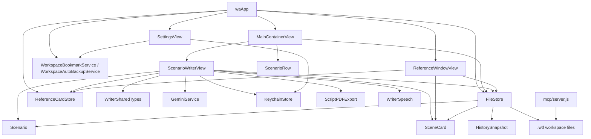

# 00 Project Index

## Repository Snapshot

- Repository root: `/Users/three/app_build/wa`
- Primary app target: `wa` (`WTF.app`)
- Platform detected: macOS SwiftUI app with substantial AppKit integration, not an iOS-only codebase
- App category detected: complex text editing / screenplay-style structured writing tool
- Swift source files in app target: 28
- `View` conformances: 16
- Dedicated `ViewModel` files: 0

## 1. Complete Folder Structure

Notes:
- Generated/vendor-heavy folders are shown but collapsed where expansion would add noise without improving architectural understanding.
- `mcp/` is repository-local tooling and is not part of the Xcode app target.

```text
.
├── .codex_derived/
│   ├── Build/
│   ├── CompilationCache.noindex/
│   ├── Index.noindex/
│   ├── Logs/
│   ├── ModuleCache.noindex/
│   └── SDKStatCaches.noindex/
├── .git/
│   ├── hooks/
│   ├── info/
│   ├── logs/
│   ├── objects/
│   └── refs/
├── .sisyphus/
│   ├── drafts/
│   ├── evidence/
│   └── plans/
├── AI_DOCS/
│   ├── 00_PROJECT_INDEX.md
│   ├── 01_ARCHITECTURE_DIAGNOSIS.md
│   ├── 02_PERFORMANCE_REFACTORING.md
│   └── 03_MAIN_NAVIGATION_PERFORMANCE_PLAN.md
├── mcp/
│   ├── node_modules/                    # npm dependencies, collapsed
│   ├── package-lock.json
│   ├── package.json
│   ├── README.md
│   ├── scenario-store.js
│   └── server.js
├── wa.xcodeproj/
│   ├── project.pbxproj
│   ├── project.xcworkspace/
│   │   ├── contents.xcworkspacedata
│   │   └── xcuserdata/
│   ├── xcshareddata/
│   │   └── xcschemes/
│   │       └── wa.xcscheme
│   └── xcuserdata/
│       └── three.xcuserdatad/
│           ├── xcdebugger/
│           └── xcschemes/
├── wa/
│   ├── Assets.xcassets/
│   │   ├── AccentColor.colorset/
│   │   │   └── Contents.json
│   │   ├── AppIcon.appiconset/
│   │   │   ├── Contents.json
│   │   │   ├── icon_16x16.png
│   │   │   ├── icon_32x32.png
│   │   │   ├── icon_64x64.png
│   │   │   ├── icon_128x128.png
│   │   │   ├── icon_256x256.png
│   │   │   ├── icon_512x512.png
│   │   │   └── icon_1024x1024.png
│   │   └── Contents.json
│   ├── ContentView.swift
│   ├── FocusMonitor.swift
│   ├── GeminiService.swift
│   ├── KeychainStore.swift
│   ├── MainContainerView.swift
│   ├── Models.swift
│   ├── ReferenceWindow.swift
│   ├── Sans Mono CJK Final Draft Bold.otf
│   ├── Sans Mono CJK Final Draft.otf
│   ├── ScenarioRow.swift
│   ├── ScriptPDFExport.swift
│   ├── SettingsView.swift
│   ├── WorkspaceSelectionHelpers.swift
│   ├── WriterAI+CandidateActions.swift
│   ├── WriterAI+ChatView.swift
│   ├── WriterAI+PromptBuilder.swift
│   ├── WriterAI+RAG.swift
│   ├── WriterAI+ThreadStore.swift
│   ├── WriterAI.swift
│   ├── WriterCardManagement.swift
│   ├── WriterCardViews.swift
│   ├── WriterCaretAndScroll.swift
│   ├── WriterFocusMode.swift
│   ├── WriterHistoryView.swift
│   ├── WriterKeyboardHandlers.swift
│   ├── WriterSharedTypes.swift
│   ├── WriterSpeech.swift
│   ├── WriterUndoRedo.swift
│   ├── WriterViews.swift
│   └── waApp.swift
├── Info.plist
├── README.md
├── plan.md
├── plan1.md
├── plan2.md
└── research.md
```

## 2. Major Modules

| Module | Files | Responsibility |
| --- | --- | --- |
| App shell and workspace lifecycle | `waApp.swift`, `MainContainerView.swift`, `WorkspaceSelectionHelpers.swift` | App entry, window/scenes, workspace bookmark restore, auto backup, main scenario selection, split pane shell |
| Domain model and persistence | `Models.swift` | `Scenario`, `SceneCard`, history snapshots, workspace file schema, load/save pipeline, cross-scenario shared craft sync |
| Main writer workspace | `WriterViews.swift`, `WriterSharedTypes.swift`, `WriterCardViews.swift`, `WriterCardManagement.swift`, `WriterKeyboardHandlers.swift`, `WriterCaretAndScroll.swift`, `WriterFocusMode.swift`, `WriterHistoryView.swift`, `WriterUndoRedo.swift` | Primary editing experience, card tree rendering, focus mode, keyboard behavior, scroll/caret sync, history/undo, export triggers |
| AI authoring features | `WriterAI.swift`, `WriterAI+PromptBuilder.swift`, `WriterAI+RAG.swift`, `WriterAI+ThreadStore.swift`, `WriterAI+CandidateActions.swift`, `WriterAI+ChatView.swift`, `GeminiService.swift`, `KeychainStore.swift` | AI chat threads, prompt building, embeddings/RAG, candidate generation, persistence, API calls, API key storage |
| Reference workspace | `ReferenceWindow.swift` | Secondary floating reference-card window, per-window undo/redo, lightweight persistence for pinned cards |
| Speech and dictation | `WriterSpeech.swift` | Speech permissions, live dictation recording, transcript handling, Apple Intelligence summary integration |
| Export pipeline | `ScriptPDFExport.swift` | Structured screenplay-style parsing and PDF generation |
| Settings and preferences | `SettingsView.swift` | Appearance, AI model selection, backup/workspace controls, export defaults, shortcuts, legal/about |
| Debug/monitoring support | `FocusMonitor.swift` | Focus instrumentation/logging panel |
| External tooling | `mcp/` | Scenario-scoped MCP server that reads/writes the same `.wtf` workspace schema outside the app target |

## 3. View Files

Files containing SwiftUI `View` types:

| File | View types |
| --- | --- |
| `wa/MainContainerView.swift` | `MainContainerView` |
| `wa/ScenarioRow.swift` | `ScenarioRow` |
| `wa/ReferenceWindow.swift` | `ReferenceWindowView`, `ReferenceCardEditorRow` |
| `wa/FocusMonitor.swift` | `FocusMonitorWindowView` |
| `wa/SettingsView.swift` | `SettingsView` |
| `wa/WriterCardViews.swift` | `DropSpacer`, `PreviewCardItem`, `FocusModeCardEditor`, `CardItem` |
| `wa/WriterViews.swift` | `ScenarioWriterView`, `MainCanvasHost`, `TrailingWorkspacePanelHost`, `HistoryOverlayHost`, `WorkspaceToolbarHost`, `BottomHistoryBarHost` |

Summary:
- 7 source files contain SwiftUI views
- 16 distinct `View` conformances exist in the app source
- `wa/ContentView.swift` exists but is empty and not contributing UI

## 4. ViewModel Files

Dedicated `ViewModel` files were not found.

The codebase instead uses a mixed pattern:

| File | Type | Role |
| --- | --- | --- |
| `wa/WriterSharedTypes.swift` | `MainCanvasViewState` | Small render/scroll coordination state object for the main canvas |
| `wa/WriterSharedTypes.swift` | `ScenarioWriterObservedState` | Observable adapter that projects `Scenario` version changes into SwiftUI-friendly signals |
| `wa/ReferenceWindow.swift` | `ReferenceCardStore` | Store-like state owner for the reference window |
| `wa/FocusMonitor.swift` | `FocusMonitorRecorder` | Debug-state recorder |

Architecturally, these are view-model-like objects, but the project does not currently implement a formal MVVM layer with per-screen `ViewModel` files.

## 5. Model Files

| File | Key model types |
| --- | --- |
| `wa/Models.swift` | `Scenario`, `SceneCard`, `HistorySnapshot`, `CardSnapshot`, persistence record structs, `FileStore` |
| `wa/WriterAI.swift` | `AIChatMessage`, `AIChatThread`, `AIEmbeddingRecord`, `AIChatTokenUsage`, prompt/context payload types |
| `wa/WriterSharedTypes.swift` | Shared editor value types such as clipboard payloads, diff models, layout snapshots, drag/drop identifiers, AI action enums |
| `wa/ScriptPDFExport.swift` | Export-domain structs and enums used by PDF generation |

Primary persistence model:
- Workspace package: `.wtf`
- Root metadata file: `scenarios.json`
- Per-scenario folder layout: `scenario_<UUID>/`
- Per-scenario data files: `cards_index.json`, `history.json`, `linked_cards.json`, `card_<UUID>.txt`
- Per-scenario AI data: `ai_threads.json`, `ai_embedding_index.json`, `ai_vector_index.sqlite`

## 6. Service / Manager Files

| File | Service / manager types |
| --- | --- |
| `wa/waApp.swift` | `WorkspaceBookmarkService`, `WorkspaceAutoBackupService` |
| `wa/Models.swift` | `FileStore` |
| `wa/GeminiService.swift` | `GeminiService` |
| `wa/KeychainStore.swift` | `KeychainStore` |
| `wa/WriterSpeech.swift` | `SpeechDictationService`, `LiveSpeechDictationRecorder` |
| `wa/ReferenceWindow.swift` | `ReferenceCardStore` |
| `wa/ScriptPDFExport.swift` | `ScriptPDFGenerator`, `ScriptCenteredPDFGenerator`, `ScriptKoreanPDFGenerator`, `ScriptMarkdownParser` |
| `wa/FocusMonitor.swift` | `FocusMonitorPanelController`, `FocusMonitorRecorder` |
| `wa/WorkspaceSelectionHelpers.swift` | workspace-selection helper functions |

Observation:
- Several services live inside UI-oriented files rather than in a separate service layer folder.
- `FileStore` is both persistence layer and an application-level coordination service.

## 7. Utilities

| File | Utility role |
| --- | --- |
| `wa/WriterSharedTypes.swift` | Layout metrics, caches, clipboard payloads, helper utilities, color parsing, preference keys, AppKit bridge helpers |
| `wa/WorkspaceSelectionHelpers.swift` | Bookmark selection mode and backup path normalization helpers |
| `wa/ScenarioRow.swift` | Reusable sidebar row view |
| `wa/WriterCardViews.swift` | Reusable card-view components |
| `wa/ContentView.swift` | Empty placeholder file; currently not used |

## 8. Architecture Pattern Detected

Detected pattern:
- Hybrid SwiftUI architecture with a central store and observable domain models
- Closest description: View-heavy MVVM-adjacent structure, not a clean MVVM implementation

What is actually present:
- `waApp` owns application-wide dependencies and injects `FileStore` and `ReferenceCardStore`
- `FileStore` is the central persistence and coordination object
- `Scenario` and `SceneCard` are mutable `ObservableObject` domain models used directly by views
- `ScenarioWriterView` is the dominant feature root and is split across many extension files rather than multiple smaller feature objects
- Feature logic is distributed through `extension ScenarioWriterView` files instead of a dedicated service/view-model boundary

Practical interpretation:
- The codebase behaves like `SwiftUI View + ObservableObject Model + central Store/Service`
- It is organized more by file split and extensions than by strict architectural layers

## 9. Dependency Relationships

### High-level dependency flow



### File-level observations

- `WriterAI+CandidateActions.swift`, `WriterAI+ChatView.swift`, `WriterAI+PromptBuilder.swift`, `WriterAI+RAG.swift`, `WriterAI+ThreadStore.swift`, `WriterCardManagement.swift`, `WriterCaretAndScroll.swift`, `WriterFocusMode.swift`, `WriterHistoryView.swift`, `WriterKeyboardHandlers.swift`, `WriterSpeech.swift`, and `WriterUndoRedo.swift` all extend `ScenarioWriterView` and depend on state declared in `WriterViews.swift`.
- `ReferenceWindow.swift` depends on both `FileStore` and the core model layer, so it is not isolated from the main editing model.
- `SettingsView.swift` writes directly to `@AppStorage`, touches workspace bookmark flows, and talks to `KeychainStore` directly.
- `waApp.swift` mixes app lifecycle, storage bootstrap, backup policy, appearance control, command routing, and window management.
- `mcp/server.js` is coupled to the workspace file schema even though it is outside the Swift target.

## Structural Notes and Early Risks

- The source tree is flat. There are no folders for `Views`, `ViewModels`, `Models`, `Services`, or feature modules inside `wa/`.
- The dominant editor surface is concentrated in very large files:
  - `WriterCardManagement.swift`: 3961 lines
  - `WriterFocusMode.swift`: 2945 lines
  - `WriterViews.swift`: 2646 lines
  - `Models.swift`: 1920 lines
  - `WriterHistoryView.swift`: 1848 lines
  - `WriterKeyboardHandlers.swift`: 1750 lines
  - `SettingsView.swift`: 1500 lines
  - `WriterSharedTypes.swift`: 1458 lines
- `WriterViews.swift` contains the main feature state hub with roughly 195 property-wrapper-backed state declarations (`@State`, `@StateObject`, `@EnvironmentObject`, `@AppStorage`, `@FocusState`-adjacent structure around the root view).
- The app has no formal `ViewModel` layer; views often coordinate persistence, AppKit events, service calls, and domain mutation directly.
- `ContentView.swift` is empty, suggesting leftover template structure and weak source hygiene.

